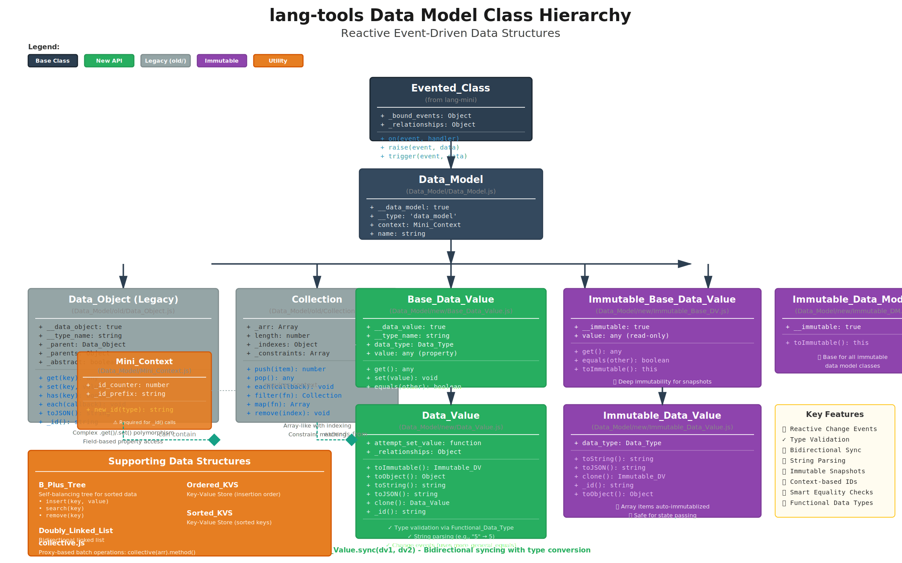
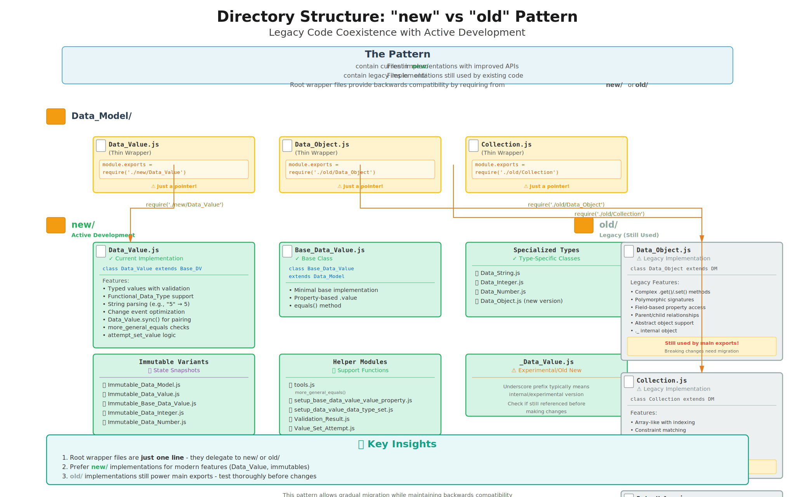

# lang-tools Architecture Diagrams

This document contains detailed SVG architecture diagrams for the lang-tools project.

## 1. Data Model Class Hierarchy

## 2. New vs Old Directory Pattern

## 3. Data Flow and Synchronization

## 4. Module Dependencies

